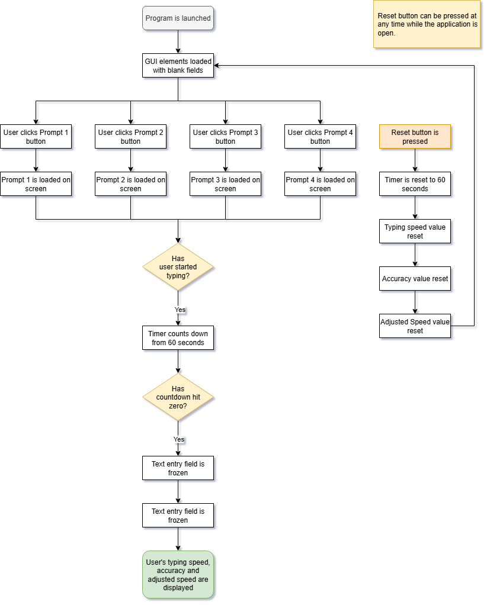

# 100 Days of Code Day 94: Dinosaur Game Automation

## Introduction
This project is day 86 of the 100 Days of Code course. For today's goal, the goal was to create a Tkinter typing test application.

This application was created using example prompts from the following website.
- https://thepracticetest.com/typing/tests/practice-paragraphs/

To calculate the net and gross WPM along with accuracy, I used the following resource. Although the outputted results look good, formulas can be tweaked in code to modify the test's results.
- https://www.typingtyping.com/wpm-calculator/

The application has four prompts with the following word lengths.
-	Test 1 total words – 203
-	Test 2 total words – 194
-	Test 3 total words – 187
-	Test 4 total words - 175
## Modules Used
### TKinter
**TKinter** is the star of the show for this project and is used to create the GUI typing test application. Tkinter is used to create graphical elements as well as control the functionality of the buttons when they are pressed.
## Project Files
### Main.py
All the action in this project is accomplished in **main.py**. The Project Walkthrough section will go into details of the actions taken in the project.
### Prompts Folder and Files
The prompts folder contains the four text prompts that can be selected for the typing speed test.
## Project Walkthrough
The project can be broken down into the following subcategories.
### GUI Elements
The application has the following key GUI elements:
-	Labels displaying the time remaining, typing speed, accuracy, and adjusted speed.
-	Four buttons that the user can click on to select a typing test prompt to display.
-	The typing test prompt, which displays the prompt selected by the user.
-	The text prompt field where the user can type in.
-	A reset button to reset the application.
### Functions
The program has the following functions that are executed. This section also provides a brief description of their functionality.
-	**Pass_one through four**: These functions are tied to the prompt buttons. Based on the button that is pressed, the number specified is passed into the display_prompt function.
-	**Display_prompt**: This function opens the text in the text files stored in the prompts folder based on the number that is passed through. That text is then displayed in the text field displaying the typing text prompt.
-	**Count_down**: The count_down function triggers the program’s countdown and is triggered when a key is pressed. Once the timer hits zero, the calculate_score function is called.
-	**Key_pressed**: When a user presses a key inside of the typing prompt, this function calls the count_down function.
-	**Calculate_score**: Calculate_score calculates the users typing speed, accuracy, and adjusted accuracy once the countdown has hit zero.
-	**Reset**: Reset, resets the application, allowing for replayability.
### Logic
When the program is launched, the user is presented with four buttons to select a typing test prompt to use. Based on the option selected by the user, the text from the prompt is displayed under the "Typing Speed Test Prompt” box.

The test does not start until the user starts typing in the “Press start and type away!” text entry field.

Once text is entered, the countdown begins from 60 seconds and works its way down to zero. During this minute, the user can type in the text entry field. 

When the countdown hits zero, the user is no longer able to type in the field, and the user’s typing speed, accuracy, and adjusted speed are calculated and displayed on the screen, ending the test.

The program can be restarted and a new test administered by clicking on the reset button.

## Project Flowchart

## Project Screenshots
Screenshots for this project can be found in the [screenshots folder](/screenshots).
